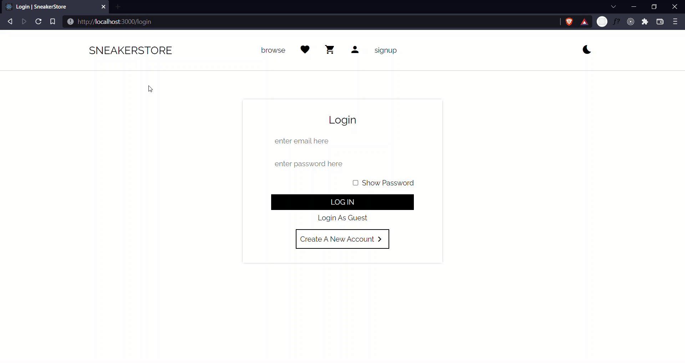

# SneakerStore

## An e-commerce web app

### To run the app locally

- Fork this repository.
- Clone the forked repository on your local machine.
- Install all the dependencies - `yarn install`.
- Run `npm start` in the console.

### App Features

- Authentication
- Signup
- Login
- Logout
- Home page with categories
- Products Page
- Product Filters
- Search Products
- Cart Management
- Wishlist Management
- Address Management
- Checkout Page
- Loading animation
- Alerts for certain actions
- Order Summary

### Libraries Used

- React Hooks for UI
- React Router v6 for client side routing
- Axios for making API requests
- [React Spinners](https://github.com/davidhu2000/react-spinners) for loading animations
- [MockBee](https://mockbee.netlify.app/) for mock backend

